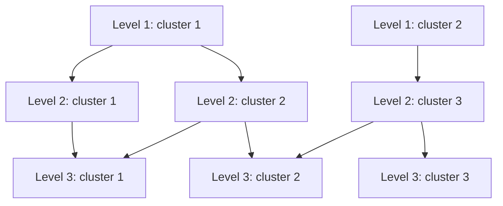
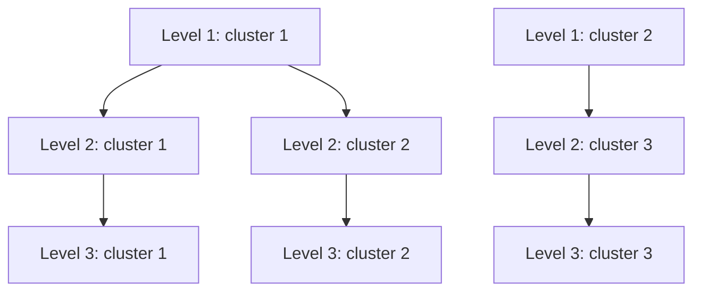

# mrtree-rs

`mrtree-rs` is a Rust implementation of the [MRtree](https://github.com/pengminshi/MRtree) algorithm for reconciling clustering labels from multiple resolutions into a consistent cluster hierarchy. Relative to the original R implementation, it offers up to 30-fold speedup.

## Background

Multiresolution clustering results often do not form a clean hierarchy. In a hierarchical clustering, each finer-resolution cluster is fully nested within a single broader cluster at the next coarser level. When that does not happen, a group at a finer level can end up split across multiple groups at the level above it, making the overall structure harder to interpret.

Consider this input label matrix:

```
sample1	1	1	1
sample2	1	1	1
sample3	1	2	1
sample4	1	2	2
sample5	2	3	3
sample6	2	3	3
sample7	2	3	2
```



In this example, the last column does not align cleanly with the middle column. After reconciliation, the matrix becomes:

```
sample1	1	1	1
sample2	1	1	1
sample3	1	1	1
sample4	1	2	2
sample5	2	3	3
sample6	2	3	3
sample7	2	3	3
```



The output keeps the same samples in the same order, but adjusts the cluster labels so the levels describe a cleaner hierarchy.

## Algorithm

`mrtree-rs` reconciles a label matrix with a greedy procedure. Instead of enumerating every possible consistent hierarchy, it repeatedly evaluates candidate fixes for the next inconsistency and applies the one with the lowest score for that round. An inconsistency occurs when a finer-resolution cluster appears under more than one broader cluster at the level above, even though a clean hierarchy requires it to be nested within exactly one broader cluster.

Each reconciliation round proceeds as follows:

1. Find all current inconsistencies in the hierarchy.
2. Keep only the first two inconsistent level pairs when scanning from coarse to fine. This makes the procedure effectively top-down while still allowing candidates from both pairs to compete in the same round.
3. For each candidate parent-child relation at those levels, build the valid paths that:
   - Preserve paths that already agree with the relation.
   - Discard paths in which the same finer-resolution cluster appears under a different broader cluster.
   - Recombine the prefix above the inconsistency with a compatible deeper suffix from another path, preserving lower-level structure when possible.
4. For each sample currently assigned to the finer-resolution cluster in that candidate, choose the remaining path with the smallest Hamming distance to the sample's original input labels.
5. Score the candidate by summing, over those samples, the sample weight multiplied by the number of levels that would change between the sample's current assigned path and its chosen replacement path.
6. Apply the candidate with the lowest total score, break ties deterministically, reassign only the rows whose current parent conflicts with the selected relation, and repeat until every finer-resolution cluster appears under exactly one broader cluster.

Two parameters affect this procedure:

- `--sample-weighting` computes one weight per sample before the greedy rounds begin, using the label matrix that enters reconciliation. If `--consensus` is enabled, that means the consensus-reduced matrix. Smaller clusters receive larger weights, making changes that disrupt those groups more expensive. For sample $i$, the weight is $w_i = \left(\sum_{\ell=1}^{L} \lvert C_{\ell}(i) \rvert\right)^{-0.5}$, where $\lvert C_{\ell}(i) \rvert$ is the size of the cluster containing $i$ at level $\ell$.
- `--augment-path` introduces placeholder labels written as `-1` when this preserves structure that would otherwise be forced into a less informative hierarchy. `-1` represents a synthetic intermediate assignment, not a real input cluster label.

## Installation

`mrtree-rs` binaries are available for download in the [releases](https://github.com/apcamargo/mrtree-rs/releases/) section of this repository. Alternatively, you can install it from Bioconda using [Pixi](https://pixi.sh/):

```sh
pixi global install mrtree-rs
```

## Usage

```
mrtree-rs [OPTIONS] [INPUT] [OUTPUT]
```

### Input format

- Input must be a TSV file with one sample ID column and at least two columns representing different clustering levels.
- Cluster labels must be non-negative integers.
- Use `--header` when the first row contains column names.

### Output format

- Output is a TSV label matrix with the same samples in the same row order.
- If `--header` is enabled, `mrtree-rs` writes a header row on output.
- Retained clustering columns are emitted from coarse to fine. If the retained input columns are out of order, `mrtree-rs` reorders them and warns on stderr.
- When `--augment-path` is enabled, synthetic labels may appear as `-1` in the output. Real input labels must still be non-negative.

### Options

| Argument/Option | Description | Default |
|-----------------|-------------|---------|
| `INPUT` | Input TSV file | `-` (stdin) |
| `OUTPUT` | Output TSV file | `-` (stdout) |
| `--header` | Treat the first row as a header and emit a header row on output | off |
| `--max-k <N>` | Keep only clustering columns where the number of clusters (`K`) is ≤ `N` | no limit |
| `--consensus` | Combine repeated clustering levels with the same `K` (same number of clusters) | off |
| `--sample-weighting` | Give more weight to samples from smaller clusters | off |
| `--augment-path` | Enable synthetic path augmentation | off |
| `--seed <N>` | Seed for deterministic consensus clustering | `0` |
| `--threads <N>` | Number of worker threads; `0` uses all available threads | `1` |
| `-v`, `--verbose` | Repeat to increase stderr logging verbosity (`-v` INFO, `-vv` DEBUG, `-vvv` TRACE) | ERROR and WARN |
| `-h`, `--help` | Print help | |
| `-V`, `--version` | Print version | |

## Examples

### Basic usage

Process a TSV label matrix from a file and write the reconciled result:

```sh
# Read from a file and write to a file
mrtree-rs clusters.tsv reconciled.tsv
# Read from stdin and write to stdout
cat clusters.tsv | mrtree-rs > reconciled.tsv
```

### Use headered input

Use `--header` when the first row contains column names. For example, if `clusters.tsv` looks like this:

```
sample_id	k1	k2	k3
sample1	1	1	1
sample2	1	2	1
sample3	2	3	2
```

Run the following command:

```sh
mrtree-rs clusters.tsv reconciled.tsv --header
```

`mrtree-rs` will treat `sample_id`, `k1`, `k2`, and `k3` as headers rather than data and include a header row in the output:

### Filter high-resolution levels

Use `--max-k` to ignore very fine clustering levels before reconciliation. For example, `--max-k 20` keeps only columns with at most `20` clusters.

```sh
mrtree-rs clusters.tsv reconciled.tsv --max-k 20
```

### Merge levels before reconciliation

If your input contains repeated clustering levels with the same number of clusters, use `--consensus` to combine them first. Use `--seed` for deterministic results. Add `--sample-weighting` when smaller clusters should carry more influence.

```sh
mrtree-rs clusters.tsv reconciled.tsv --header --consensus --seed 17
```

### Use synthetic path augmentation

`--augment-path` can preserve structure that would otherwise be forced into a less informative hierarchy. In that mode, placeholder labels are written as `-1` in the output:

```
sample1	1	1	1
sample2	1	2	1
sample3	2	1	2
```

```sh
mrtree-rs clusters.tsv reconciled.tsv --augment-path
```

```
sample1	1	1	1
sample2	1	1	1
sample3	2	-1	2
```

## Citation

If you use `mrtree-rs` in your work, please cite the original MRtree paper:

> Peng, M., Wamsley, B., Elkins, A. G., Geschwind, D. H., Wei, Y., & Roeder, K. [**"Cell type hierarchy reconstruction via reconciliation of multi-resolution cluster tree"**](https://doi.org/10.1093/nar/gkab481). *Nucleic Acids Research* 49.16 (2021): e91-e91.
