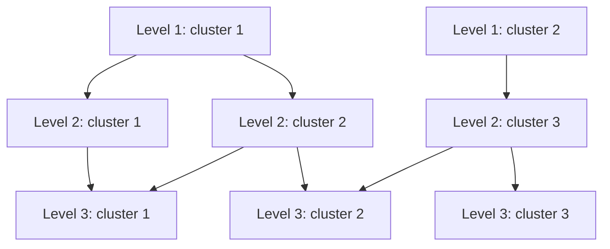
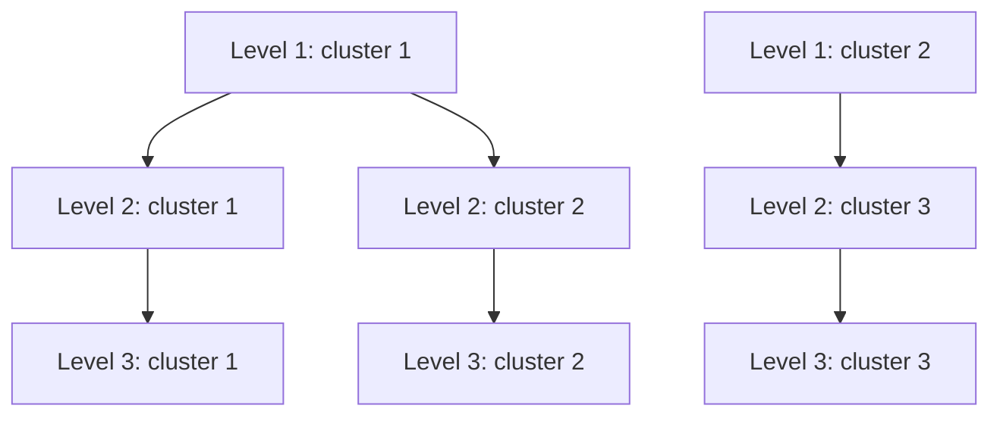

# mrtree-rs

`mrtree-rs` is a Rust implementation of the [MRtree](https://github.com/pengminshi/MRtree) algorithm for reconciling clustering labels from multiple resolutions into a consistent cluster hierarchy. Relative to the original R implementation, it offers up to 30-fold speedup.

## Background

Multiresolution clustering results often do not form a clean hierarchy. In a hierarchical clustering, each finer-resolution cluster is fully nested within a single broader cluster at the next coarser level. When that does not happen, a group at a finer level can end up split across multiple groups at the level above it, making the overall structure harder to interpret.

Consider this input label matrix:

```text
sample1	1	1	1
sample2	1	1	1
sample3	1	2	1
sample4	1	2	2
sample5	2	3	3
sample6	2	3	3
sample7	2	3	2
```



In this example, the last column does not align cleanly with the middle column. After reconciliation, the matrix becomes:

```text
sample1	1	1	1
sample2	1	1	1
sample3	1	1	1
sample4	1	2	2
sample5	2	3	3
sample6	2	3	3
sample7	2	3	3
```



The output keeps the same samples in the same order, but adjusts the cluster labels so the levels describe a cleaner hierarchy.

## Installation

`mrtree-rs` binaries are available for download in the [releases](https://github.com/apcamargo/mrtree-rs/releases/) section of this repository. Alternatively, you can install it from Bioconda using [Pixi](https://pixi.sh/):

```sh
pixi global install mrtree-rs
```

## Usage

```text
mrtree-rs [OPTIONS]
```

### Input format

- Input must be a TSV file with one sample ID column and at least two columns representing different clustering levels.
- Cluster labels must be non-negative integers.
- Use `--header` when the first row contains column names.

### Output format

- Output is a TSV label matrix with the same samples in the same row order.
- If `--header` is enabled, `mrtree-rs` writes a header row on output.
- Retained clustering columns are emitted from coarse to fine. If the retained input columns are out of order, `mrtree-rs` reorders them and warns on stderr.
- When `--augment-path` is enabled, synthetic labels may appear as `-1` in the output. Real input labels must still be non-negative.

### Options

| Option | Description | Default |
|--------|-------------|---------|
| `-i`, `--input <PATH>` | Input TSV file | `-` (stdin) |
| `-o`, `--output <PATH>` | Output TSV file | `-` (stdout) |
| `--header` | Treat the first row as a header and emit a header row on output | off |
| `--max-k <N>` | Keep only clustering columns where the number of clusters (`K`) is less than `N` | no limit |
| `--consensus` | Combine repeated clustering levels with the same `K` (same number of clusters) | off |
| `--sample-weighted` | Give more weight to samples from smaller clusters | off |
| `--augment-path` | Allow placeholder labels when needed; surviving placeholders are written as `-1` | off |
| `--seed <N>` | Seed for deterministic consensus clustering | `0` |
| `--threads <N>` | Number of worker threads; `0` uses all available threads | `1` |
| `-v`, `--verbose` | Emit preprocessing and progress details to stderr | off |
| `-h`, `--help` | Print help | |
| `-V`, `--version` | Print version | |

## Examples

### Basic usage

Process a TSV label matrix from a file and write the reconciled result:

```sh
# Read from a file and write to a file
mrtree-rs --input clusters.tsv --output reconciled.tsv
# Read from stdin and write to stdout
cat clusters.tsv | mrtree-rs > reconciled.tsv
```

### Use headered input

If your table has column names, pass `--header`. The sample header is preserved, and the retained clustering headers are emitted in coarse-to-fine order.

```sh
mrtree-rs --input clusters.tsv --output reconciled.tsv --header
```

### Filter high-resolution levels

Use `--max-k` to ignore very fine clustering levels before reconciliation. For example, `--max-k 20` keeps only columns with fewer than `20` clusters.

```sh
mrtree-rs --input clusters.tsv --output reconciled.tsv --max-k 20
```

### Merge repeated K levels before reconciliation

If your input contains repeated clustering levels with the same number of clusters, use `--consensus` to combine them first. Use `--seed` for deterministic results. Add `--sample-weighted` when smaller clusters should carry more influence.

```sh
mrtree-rs --input clusters.tsv --output reconciled.tsv --header --consensus --seed 17
```

### Use synthetic path augmentation

`--augment-path` can preserve structure that would otherwise be forced into a less informative hierarchy. In that mode, placeholder labels are written as `-1` in the output:

```text
sample1	1	1	1
sample2	1	2	1
sample3	2	1	2
```

```sh
mrtree-rs --input clusters.tsv --output reconciled.tsv --augment-path
```

```text
sample1	1	1	1
sample2	1	1	1
sample3	2	-1	2
```

## Citation

If you use `mrtree-rs` in your work, please cite the original MRtree paper:

> Peng, M., Wamsley, B., Elkins, A. G., Geschwind, D. H., Wei, Y., & Roeder, K. [**"Cell type hierarchy reconstruction via reconciliation of multi-resolution cluster tree"**](https://doi.org/10.1093/nar/gkab481). *Nucleic Acids Research* 49.16 (2021): e91-e91.
